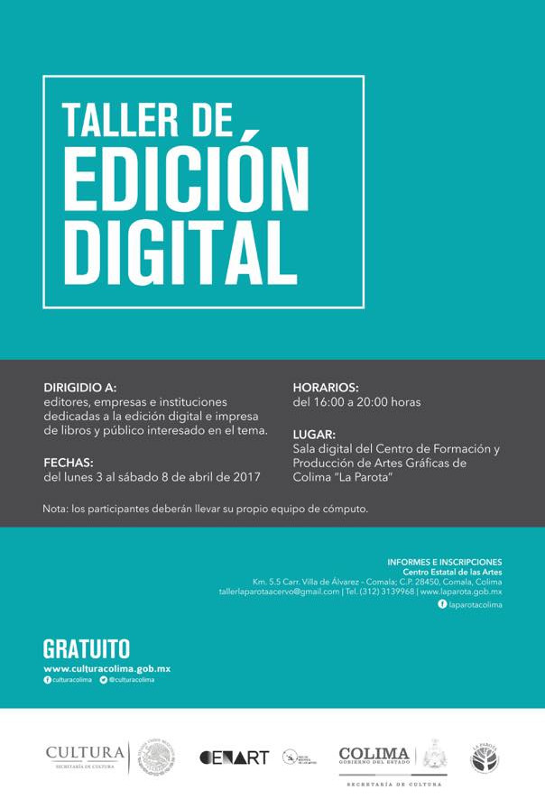

# Taller de edición digital estándar

Taller teórico-práctico para aprender el proceso metodológico para desarrollar y publicar libros en diversos formatos, tanto digital como impreso.

## Duración

24 horas, 4 horas diarias del lunes 3 al sábado 8 de abril.

## Perfil

* Personas amantes de los libros e interesados en la publicación.
* Editores de libros, sin importar que publiquen en impreso o digital.
* Colectivos o instituciones que publican libros académicos.
* Colectivos o instituciones interesados en la edición de libros multiformato.

## Requisitos

* Conocimiento básico del uso de la computadora.
* Contar con una computadora (al menos para los bloques 5-8)

Opcional pero muy recomendado:

* Conocimientos básicos de edición.
* Conocimientos de tecnologías web
* Conocimientos de uso básico de terminal.

## Temas

### Lunes

#### Bloque 1

1. Breve historia de la edición digital.

#### Bloque 2

2. ¿Qué es la edición digital?
3. ¿Qué son las publicaciones digitales?

### Martes

#### Bloque 3

4. Procesos tradicionales de publicación.
5. Los procesos tradicionales en el contexto digital: edición cíclica.

#### Bloque 4

6. Nuevos procesos de publicación para el contexto digital: edición ramificada.
7. *Single source and online publishing*.

### Miércoles

#### Bloque 5

8. Formato Markdown como archivo madre.
9. Del Markdown a *web*.

#### Bloque 6

10. Del Markdown al EPUB (y MOBI).

### Jueves

#### Bloque 7

11. Del Markdown al PDF con TeX.

#### Bloque 8

12. Del Markdown al PDF con InDesign.

### Viernes

#### Bloque 9

13. Edición digital y propiedad intelectual: más allá del DRM.

#### Bloque 10

14. Distribuidores digitales comunes: iTunes, Google Play, Amazon y Gandhi.

### Sábado

#### Bloque 11

15. Edición libre y libre acceso: más allá del Creative Commons.
16. Distribuidores digitales alternativos: Leanpub, Internet Archive, LibGen y Aaaaarg.

#### Bloque 12

17. Edición digital como empoderamiento tecnológico.
