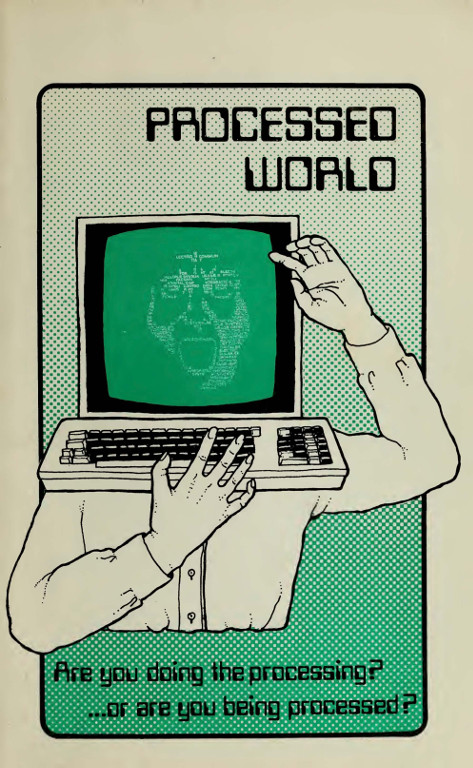
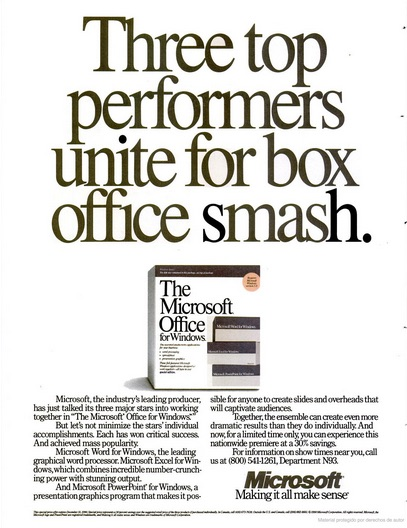
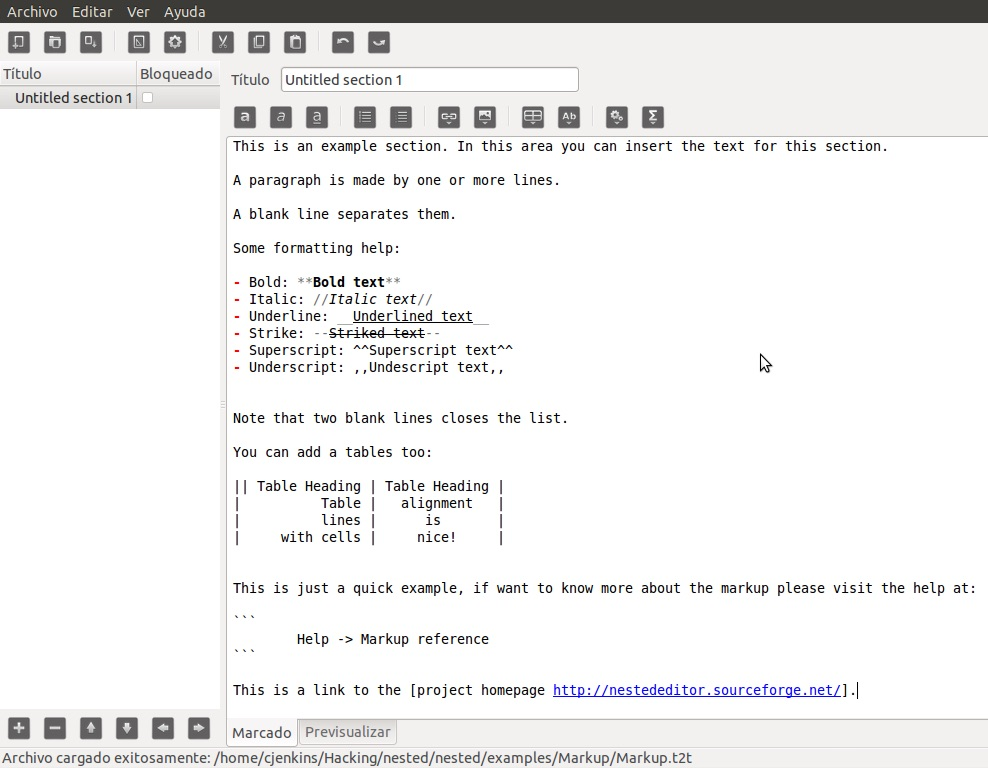
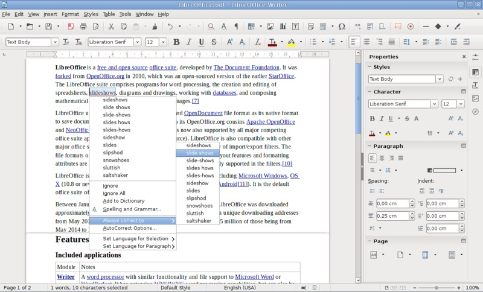
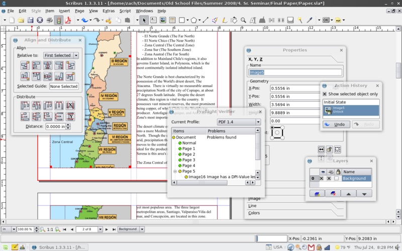
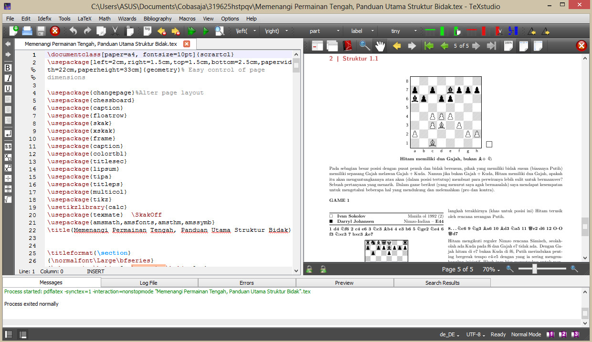
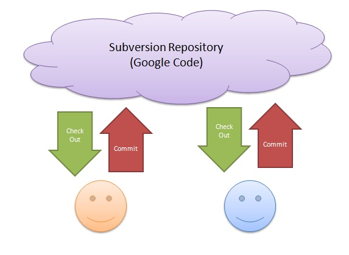

# Breve historia de la edición digital

## Recursos

* «Historia de la edición digital».
	* [Descargar como EPUB](https://github.com/NikaZhenya/historia-de-la-edicion-digital/blob/master/ebooks/produccion/historia-de-la-edicion-digital.epub?raw=true)
	* [Descargar como MOBI](https://github.com/NikaZhenya/historia-de-la-edicion-digital/blob/master/ebooks/produccion/historia-de-la-edicion-digital.mobi?raw=true)
	* [Descargar como PDF](https://github.com/NikaZhenya/historia-de-la-edicion-digital/raw/master/ebooks/produccion/historia-de-la-edicion-digital.pdf)
	* [Leer en línea](https://nikazhenya.gitbooks.io/historia-de-la-edicion-digital/content/).
* Historiade la edición.
	* [*Track Changes: A literary history of word processing*](https://github.com/ColectivoPerroTriste/taller-secretaria-cultura-colima/raw/master/bloque01/recursos/track-changes.epub)
* *Software* libre o de código abierto.
	* [LibreOffice](https://es.libreoffice.org/)
	* [Scribus](https://www.scribus.net/)
	* [TeXstudio](http://texstudio.sourceforge.net/)
	* [Inkscape](https://inkscape.org/es/)
	* [Gimp](https://www.gimp.org/)

## Contenidos del bloque

### De lo técnico a lo administrativo

* Las pianolas y la reproducción de textos.
	* El texto para facilitar la programación.
* Procesador de texto.
	* *Ofimática*: la autmatización de las oficinas.
	* Nacimiento del procesador como *hardware*.  
* Popularización de los procesadores de texto.
	* Caída en los costos de *hardware*.
	* Masificación de las computadoras personales.
	* Nacimiento del procesador como *software*.
  

  
### De la oficina a la edición digital

* «Guerra» de formatos.
	* De WordStar a Microsoft Word.
	* Adiós IBM, bienvenido Microsoft.
	* Microsoft Word como sinónimo de «procesador de texto».
  

  
* «Guerra» de enfoques.
	* Enfoque WYSIWYG: *lo que ves es lo que obtienes*.
	* Procesadores de texto y WYSIWYG.
	* Enfoque WYSIWYM: *lo que ves es lo que quieres decir*.
	* Lenguajes de marcado y WYSIWYM.

  
* Surgimiento del *Dektop plublishing*.
	* *Software* para *diseño* editorial.
	* De PageMaker a InDesign.
	* Popularización del PDF.
	* Adobe, el omnipresente.
  
### Gestación paralela

* Búsqueda de apertura y de libertad.
	* Libertad de usar, estudiar, distribuir y mejorar un programa.
	* Procesadores de texto de código abierto.
	* *Desktop publishing* de código abierto.

* TeX, el incomprendido.
	* La edición hecha código.

* Flujo gráfico de trabajo.
	* Inkscape.
	* Gimp.
  
### Actualidad

* Surgimiento de la «publicación digital»
	* De la transcripción a la digitalización.

* Manejo de versiones.
	* ¡No más respaldos!
* Necesidad multiformato.
	* Libro impreso y digital.
	* No todo es PDF.
* ¿Y ahora?
	* Analfabetismo digital.
	* ¿Retorno al enfoque WYSIWYM?
	* ¿*Hackedición*?
 
