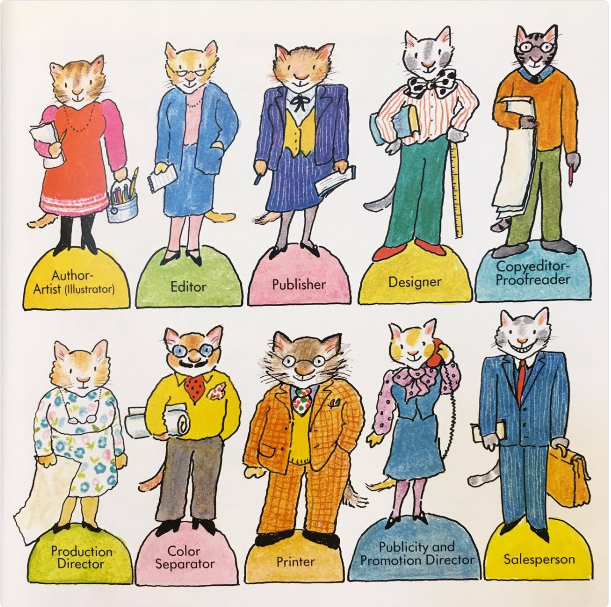

# Edición digital y publicaciones digitales

## Recursos

* Edición.
	* [*La edición sin editores*](https://github.com/ColectivoPerroTriste/taller-secretaria-cultura-colima/raw/master/bloque01/recursos/edicion-sin-editores.epub)
	* [*El elogio de los amanuenses*](https://github.com/ColectivoPerroTriste/taller-secretaria-cultura-colima/raw/master/bloque01/recursos/elogio-de-los-amanuenses.epub)
	* [«*Appbooks* y realidad aumentada. ¡No todo son *ebooks*!»](http://marianaeguaras.com/appbooks-y-realidad-aumentada-no-todo-son-ebooks/)
	* [«Hacia un boceto de editorial descentralizada»](https://pillku.org/article/hacia-un-boceto-de-editorial-descentralizada/)

* Ejemplos de formatos para publicaciones digitales.
	* [EPUB](libgen.io/book/index.php?md5=D2505E943D86ED82848415B1B86FB9E6)
	* [*Apbook*](https://itunes.apple.com/mx/app/en-busca-de-kayla/id1167229912?mt=8)
	* [Documentación](https://blog.ghost.org/markdown/)
	* [Medium](https://medium.com/)
	* [Fanzine](https://archive.org/details/HardKodeZine01)
	* [Infografía](http://mujermigrante.mx/wp-content/uploads/2017/03/Trabajo-domestico-no-remunerado.pdf) 
	* [Curso en línea](http://mujermigrante.mx/oas/migracion-calificada/)
	
* Otros sitios de interés.
	* [Editions at Play](https://editionsatplay.withgoogle.com/)
	* [Electronic Literature Organization](http://eliterature.org/)

## Contenidos del bloque

### ¿Qué es la edición digital?

* Discusión: ¿Qué es la edición?
* Edición digital no es lo mismo que publicación digital.
* La invisibilización del trabajo editorial.
* No solo los libros requieren de edición.
* Todas las personas hacemos edición digital: discutir ejemplos.

	
### ¿Qué son las publicaciones digitales?

* Discusión: ¿Qué es un producto editorial?
	* Ideas populares:
		* «Es todo aquel que tenga el formato de revista, libro, periódico, folleto, es decir: un impreso que sea de una dimension mayor a un simple cartel o volante».
		* «Todo lo que se pueda imprimir».
		* «Una peculiaridad de los productos editoriales es que habitualmente los encontramos en quioscos y librerías».
* La hegemonía del papel.
* Soporte específico de las publicaciones digitales.
* Formatos y soportes electrónicos: alcances cada vez más amplios.
	* Libros electrónicos (EPUB, PDF, GitBook).
	* Sitios web (revistas, blogs, redes sociales, plataformas específicas).
	* Contenidos digitales (infografías, GIF, carteles, materiales audiovisuales).
	* Materiales didácticos (documentación, manuales, tutoriales).
	* Plataformas híbridas (videojuegos, *appbook*).
* Siempre recordar: que un producto solo tenga soporte digital no significa que no requiera de cuidado editorial.
