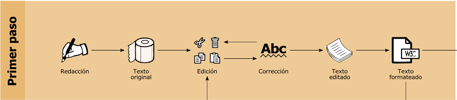
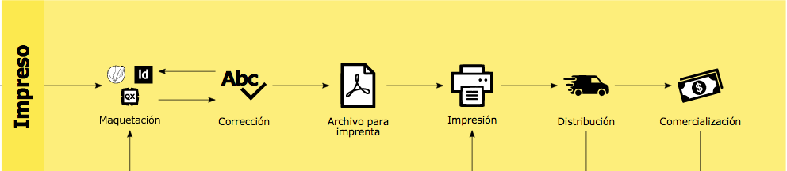
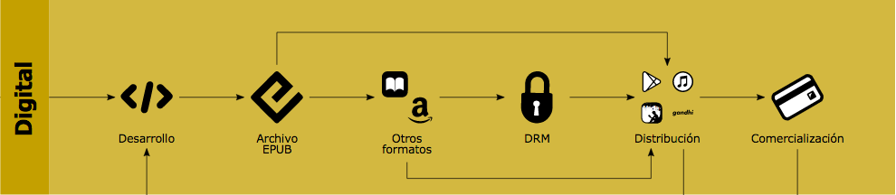
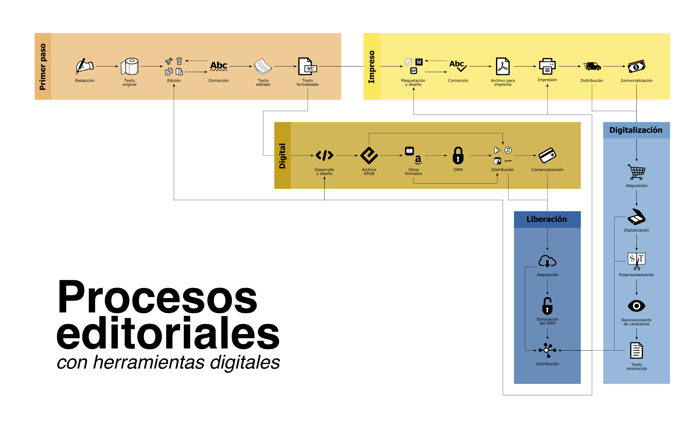
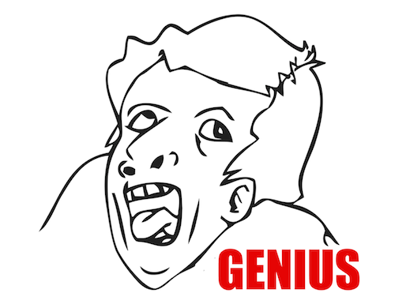

# Edición cíclica

## Recursos

* Procesos de edición.
	* [Lineamientos para la corrección de estilo](https://blognisaba.wordpress.com/2010/10/27/lineamientos-para-la-correccion-de-estilo/)
* Digitalización.
	* [Documentación](https://github.com/ColectivoPerroTriste/Tapancazo)
	* [ScanTailor](http://scantailor.org/)
	* [Herramientas para quitar DRM](https://github.com/apprenticeharper/DeDRM_tools)

## Contenidos del bloque

### Procesos tradicionales de publicación

* Proceso básico general.
	* Generación del contenido.
		* Proceso de investigación, creación, redacción.
		* Retomar contenidos previos.
		* Creación colaborativa.
		* Selección de materiales.
	* Edición de contenido.
		* Corrección… ¿de estilo?
		* Distintas etapas de corrección.
		* Gramática, ortografía, ortotipografía, uso del lenguaje y uniformidad.
		* Perfeccionar aunque la perfección absoluta sea una utopía.
		* No basta alguien con «buena ortografía»: habilidades específicas, actualización constante.
		* Conocer reglas antes de desecharlas (ejemplo: lenguaje incluyente).
		* También quienes editan necesitan corrección.
	* Formateo del texto.
		* Estructurar y jerarquizar.
		* Procesadores de texto (WYSIWYG) o lenguajes de marcado (WYSIWYM).

* Proceso para publicación impresa.
	* Maquetación y diseño.
	* Corrección ortotipográfica.
	* Impresión.

* Proceso para publicación digital.
	* Diseño y desarrollo.
	* Formato (EPUB, MOBI, LaTeX, GitBook).

> Siguiendo el proceso tradicional, ¿cómo migrar de un formato a otro?

>«¡Vamos a digitalizar nuestros libros para hacerlos EPUB!»

* Digitalización y liberación: procesos transversales.
	* ¿Por qué digitalizar?
		* Nociones comunes: preservación de materiales, respaldo.
		* Facilitar acceso a la información y a los contenidos culturales: derecho de acceso a la cultura.
		* Compartir materiales de manera libre.
		* Visibilizar diferentes identidades culturales.
		* Generar memorias comunitarias: materiales cotidianos.
		* De preferencia, **no** para reeditar libros que ya fueron editados en un soporte digital.

* El modelo tradicional no solo es cíclico, sino jerárquico e incluso elitista en ocasiones.
	* Editorial evalúa y aprueba o rechaza (según canon).
	* Dependencia total de una empresa editorial para todos los procesos.
	* Falsa expectativa de que la edición garantice el éxito de la publicación.
	* Empoderamiento gracias a la tecnología: autopublicación.
	* Riesgo: a veces se pierde de vista el cuidado editorial necesario.

### Los procesos tradicionales en el contexto digital: edición cíclica

> Pensar un proceso editorial solo en función de un formato entorpece el trabajo para otros posibles soportes.
* Limitaciones.
	* Se requiere de un proceso de ingeniería inversa:
		 * Digitalización.
		 * Posprocesamiento.
		 * Reedición.
	* Se pueden generar nuevos errores en la migración de un formato a otro.
	* Se pierde tiempo al repetir procesos o generar nuevos procesos innecesarios.
> Si una publicación pretende un aclance digital es primordial adoptar desde el inicio un proceso que facilite tal propósito.

