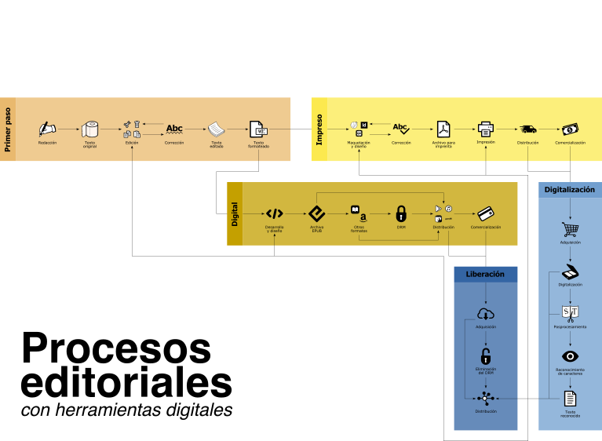

# Edición cíclica

## Recursos

## Contenidos del bloque

### Procesos tradicionales de publicación.

* Proceso básico general.
	* Generación del contenido (incluso de publicación previa).
	* Edición y correción (distintos niveles).
	* Formateo del texto.
* Proceso para publicación impresa.
	* Maquetación y diseño.
	* Corrección ortotipográfica.
	* Impresión.
* Proceso para publicación digital.
	* Diseño y desarrollo.
	* Formato (EPUB, MOBI, LaTeX, GitBook).

### Los procesos tradicionales en el contexto digital: edición cíclica.

* Limitaciones
Pensar un proceso editorial solo en función del formato impreso entorpece el trabajo para otros posibles soportes.
	* Se requiere de un proceso de ingeniería inversa:
		* Digitalización.
		* Posprocesamiento.
		* Redición.
	* Se pierde tiempo al repetir procesos o generar nuevos procesos innecesarios.
* Si una publicación pretende un aclance digital es primordial adoptar un proceso que facilite tal propósito.

