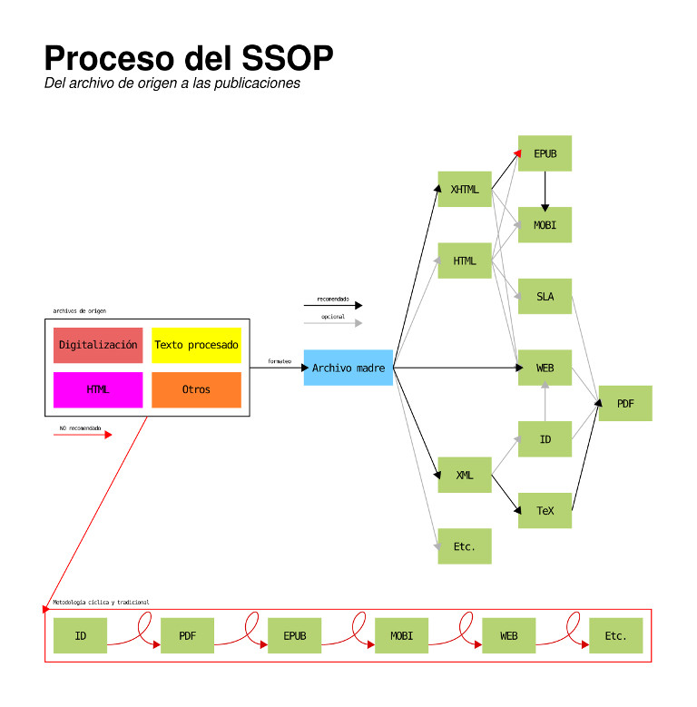

# Edición ramificada

## Recursos

* Lecturas.
	* [«¿Single source y online publishing, fuera de la realidad?»](http://marianaeguaras.com/single-source-online-publishing-la-realidad/)
	* [«¿Qué es Git/GitHub»](https://barradevblog.wordpress.com/2013/01/21/que-es-gitgithub/)
* *Software*.
	* [Git](https://git-scm.com/)
	* [Git en Wikipedia](https://es.wikipedia.org/wiki/Git)
	* [Herramientas de Perro Triste](http://herramientas.perrotriste.io/)
* Tutoriales.
	* [Git en 15 minutos](https://try.github.io/levels/1/challenges/1)
	* [Aprende git](https://www.codecademy.com/learn/learn-git)

## Contenidos del bloque

### Necesidades actuales

1. Publicación multiformato.
2. Disminución de tiempo y esfuerzo.
3. Control en la calidad de la edición.
4. Facilidad de cambio y uso entre formatos.

### *Single source and online publishing* (SSOP)

* *Single source*.
	* «Un Archivo para gobernarlos a todos».
	* De lo general a lo particular.
  
 
 
* *Online publishing*.
	* ¡Al servidor!
	* Repositorio con gestor de versiones (p. ej. git).

### Ventajas del SSOP

1. Mayor control semántico y estructural del contenido.
2. ~~El tiempo de publicación es proporcional a la cantidad de formatos deseados~~.
3. No más respaldos.
4. Posibilidad de actualización continua.
5. Posibilidad de agregar excepciones sin afectar otros formatos.
6. Fin a la transmisión de errores entre formatos.

### SSOP con sabor a perro

* [Herramientas de Perro Triste](http://herramientas.perrotriste.io/).
	* Del Markdown a EPUB, PDF, MOBI, *web* y más.
	* Uso desde la terminal.
  
> ¿Listos para talachar?
