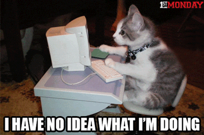

# El maravilloso mundo de Markdown

## *Software* necesario

* [Geany](http://www.geany.org/)
* [Mozilla firefox](https://www.mozilla.org/en-US/firefox/new/)
* [Markdown viewer](https://addons.mozilla.org/en-US/firefox/addon/markdown-viewer/)
* [Pandoc](http://pandoc.org/)
* [`pt-pandog`](https://github.com/ColectivoPerroTriste/Herramientas/tree/master/Archivo-madre/1-Pandog)

## Recursos

* [Sintaxis básica de Markdown](https://github.com/adam-p/markdown-here/wiki/Markdown-Cheatsheet)
* [Documentación oficial de Markdown](https://daringfireball.net/projects/markdown/syntax)
* [The ultimate guide to Markdown](https://blog.ghost.org/markdown/)
* [Artículo de Markdown en Wikipedia](https://es.wikipedia.org/wiki/Markdown)
* [Documentación oficial de Pandoc](http://pandoc.org/getting-started.html)

## Contenidos del bloque

### Formato Markdown como archivo madre

* ¿Qué es Markdown?
* Ventajas frente a otros lenguajes de marcado (HTML o TeX, por ejemplo).
	* Rápido, simple, legible e intuitivo.
	* Facilita tanto la escritura como la lectura de documentos.
* Ventajas frente a programas de edición de texto.
	* Fluidez en la escritura.
	* Brinda estructura, no solo apariencia.
	* Posibilidad de conversión a otros lenguajes y formatos.


	
* Ventajas específicas para el trabajo editorial.
	* Permite revisiones y correcciones sin distracción.
	* Puede ser modificado sin necesidad de profundos conocimientos del código.
* Markdown como base para la edición ramificada.
	* Un solo archivo con Markdown puede ser exportado a múltiples plataformas.
	* Permite partir de lo simple a lo complejo, evitando heredar elementos innecesarios a todos los formatos.
	* Facilita el control completo y uniforme del diseño.
	* Mejora el proceso editorial tanto para soportes digitales como impresos.
* Recomendaciones para dar formato al documento en Markdown.
	* Antes de iniciar con el formato, tener muy clara la estructura total de la publicación.
	* Divide y vencerás. Se aconseja colocar en archivos diferentes: elementos preliminares, contenido principal, elementos finales, notas al pie, bibliografía e índices analíticos.
	* Cuidar desde un inicio el marcado correcto de encabezados, párrafos, bloques de cita, itálicas, negritas, etcétera.
* ¡Manos a la obra! Comencemos a dar formato en Markdown...



### Del Markdown a web (HTML)

* ¿Para qué convertir de Markdown a web?
	* Inicio de edición ramificada, no formato final.
	* Es necesario convertir a HTML para acceder a soportes que requieren HTML (páginas web o EPUB).

### Pasos para ir del MD a *web*

1. Tener instalado Pandoc y `pt-pandog`.
2. Contar con un archivo Markdown.
3. Utilizar `pt-pandog` para crear el archivo HTML:

    ```
    pt-pandog -i archivo-a-convertir.md -o index.html
    ```
    
8. ¡Listo!
	* Ahora puedes abrir el documento en cualquier explorador e incluso
	subirlo a un servidor para tener una página web.


