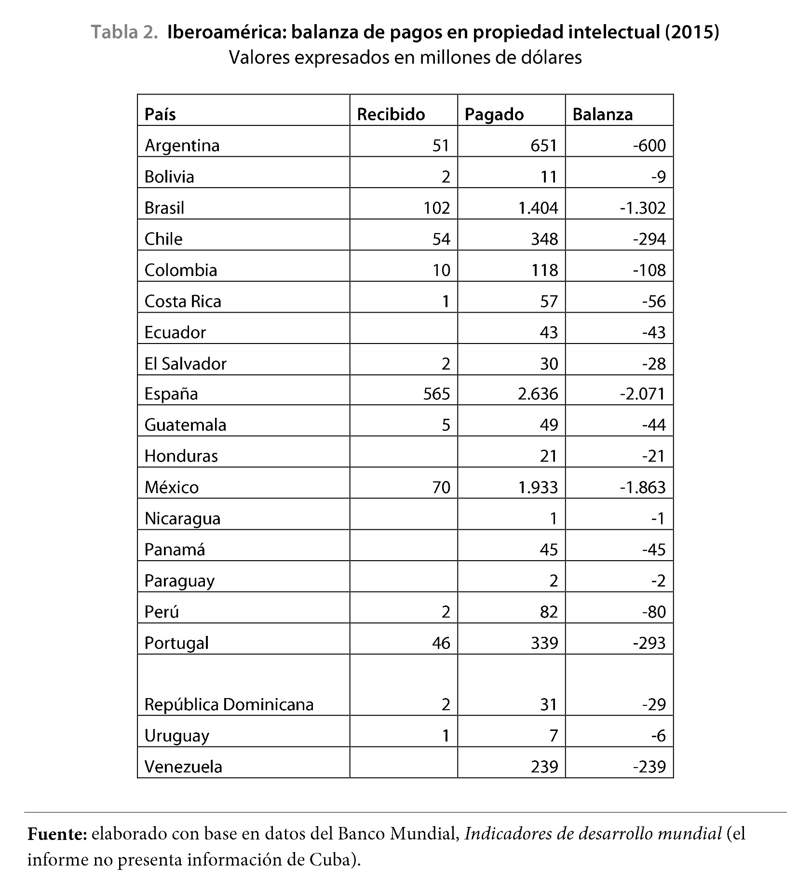

# Edición digital y propiedad intelectual: más allá del DRM.

## Recursos

* Artículos.
	* [DRM en Electronic Frontier Foundation](https://www.eff.org/issues/drm)
	* [What is DRM? ](https://defectivebydesign.org/what_is_drm_digital_restrictions_management)
	* [*América Latina: la balanza comercial en propiedad intelectual*](recursos/cerlalc.pdf)
	* [«¿*Software* libre o de élite?»](https://archive.org/details/PropiedadIntelectual)
* Manifiestos.
	* [Budapest Open Access Initiative](http://www.budapestopenaccessinitiative.org/boai-10-translations/spanish)
	* [«El manifiesto GNU»](https://archive.org/details/PropiedadIntelectual)
* Sitios de interés.
	* [Creative Commons México](http://www.creativecommons.mx/faq/)
	* [Free Software Foundation](https://www.fsf.org/)
	* [Libreplanet](https://libreplanet.org/wiki/Main_Page)

## Contenidos del bloque

* ¿Qué es la propiedad intelectual (PI)?
	* Las tres dimensiones de la PI: expresión, control y sistema.
* Derechos de Autor (DA) como una manifestación de la PI.
	* Las tres dimensiones que justifican los DA: mérito, incentivo y persona.
* DA como mecanismo de control en el contexto digital.
	* *El código es ley*: DRM.
	* ¿A quién le beneficia el DRM?
	* La economía de la PI en América Latina.
	

	
* Alternativas al DRM.
	* Copyleft.
	* Movimiento del libre acceso (Open Access, OA).
	* Creative Commons (CC).
* ¿CC vs. DA?
	* Situación legal de CC en México.
	* Una antigua historia: licencias de uso.
