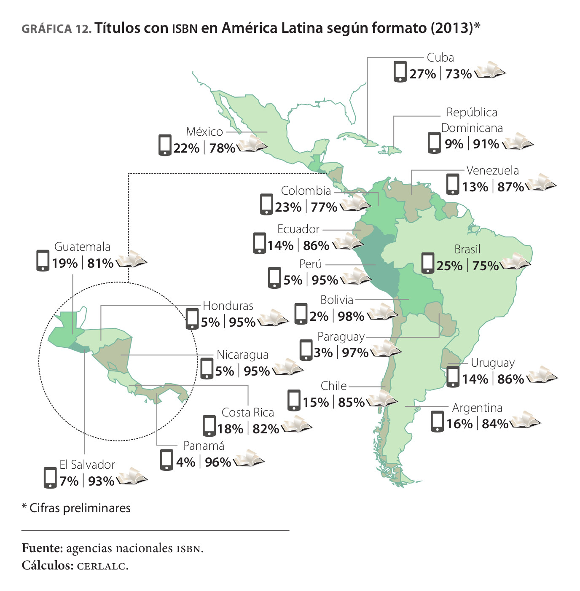

# Distribuidores digitales comunes

## Recursos

* Artículos.
	* [*El espacio iberoamericano del libro*](recursos/cerlalc2.pdf)
	* [E-Book Royalty Calcumatic: Notes](http://deirdre.net/writing/ebooks/ebook-notes/) 
	* [Amazon Royalty Options](https://kdp.amazon.com/help/topic/A30F3VI2TH1FR8) 
* Sitios de interés.
	* [iTunes](https://itunespartner.apple.com/es/books/overview)
	* [Google Play](https://support.google.com/books/partner)
	* [Amazon](https://kdp.amazon.com/help)
	* [Gandhi](https://www.gandhi.com.mx/contacts)

## Contenidos del bloque

* El *ebook* en América Latina.
	* Representa menos del 10% de la venta de libros.
	* «Mercado emergente».
	* Principales distribuidores: Amazon, Google Play, iTunes y Gandhi (México).
	
* iTunes:
	* 70% de regalías del precio de venta al público (PVP).
	* Requiere de un *Tax ID* (par estadounidense al RFC, no tiene costo).
	* Pagos cada 45 días con un mínimo de 150 USD.

* Google Play:
	* 70% de regalías del PVP, **ojo: se han reportado 52%**.
	* Requiere afiliación sin cupo desde hace años.
	* Pagos mensuales sin mínimo necesario.

* Amazon:
	* Entre 35 y 70% de regalías del PVP.
	* Sin requisitos adicionales a tener una cuenta en Amazon.
	* Pagos cada 60 días con un mínimo de 100 USD.

* Gandhi:
	* Entre el 65 y 70% de regalías del PVP.
	* Requiere realizar trámites con personal de Gandhi y en papel.
	* Variable, según el acuerdo.
