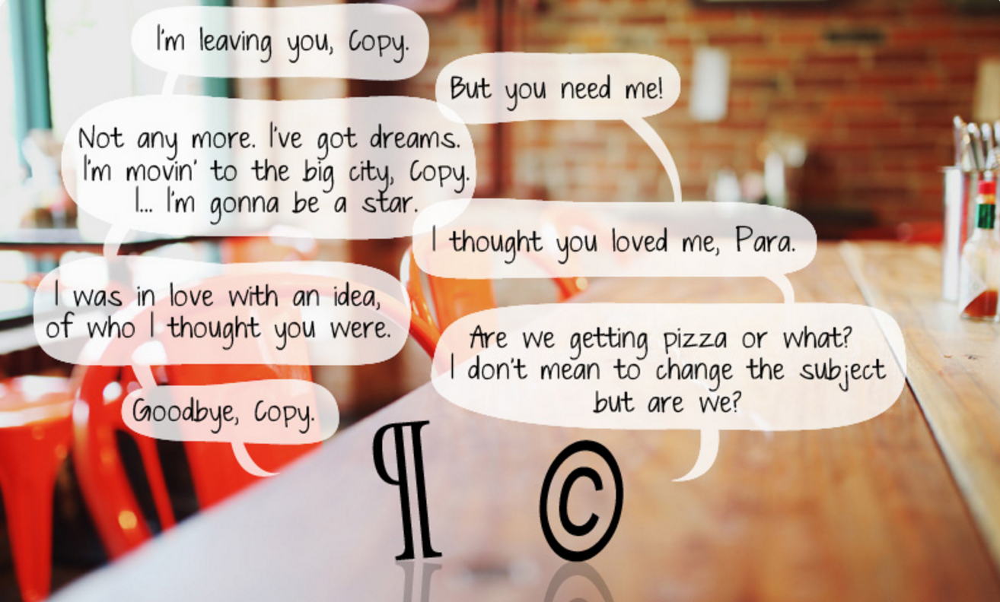

# Edición libre

## Recursos

* Materiales de consulta
	* [Diferencias entre libre, abierto y gratuito](https://radioslibres.net/article/libre-abierto-y-gratuito/)
	* [Sitio web de dominio público por elección](http://itspronouncedmetrosexual.com/2013/11/uncopyright/#sthash.ydEIeXJF.dpbs)
	* [*¿Propiedad intelectual? Una recopilación de ensayos críticos*](https://archive.org/details/PropiedadIntelectual)

* Licencias alternativas
	* [Licencia CopyFair](https://wiki.p2pfoundation.net/CopyFair_License)
	* [Licencia de Producción entre Pares](http://endefensadelsl.org/ppl_deed_es.html)
	* [Licencia Editorial Abierta y Libre](https://github.com/ColectivoPerroTriste/licencia-editorial-abierta-y-libre)
	
* Plataformas de distribución
	* [Internet Archive](https://archive.org/)
	* [LibGen (Library Genesis)](http://libgen.io/)
	* [Aaaarg](http://aaaaarg.fail/)
	* [Leanpub](https://leanpub.com/)
	* [EPUB Libre](https://epublibre.org/)
	* [Open Library](https://openlibrary.org/)
	* [Public Domain Review](https://publicdomainreview.org/)
	* [Guía para encontrar literatura libre de DRM](https://defectivebydesign.org/guide/ebooks)

## Contenidos del bloque

### Edición libre y libre acceso: más allá de Creative Commons

> Todo trabajo creativo es una derivación y nace de un bagaje cultural previo.

[Video: All creative work is derivative.](https://www.youtube.com/watch?v=32jiDgQmYPs)

* Cultura libre y alternativas al *copyright*.
	* Creative Commons (CC).
		* Licencias que permiten establecer «solo algunos derechos reservados». No siempre son libres.
		* No rivaliza con los derechos de autor, sino que busca alternativas para compartir de forma libre y segura.
		* Aunque propone alternativas, no busca transformar el modelo económico de la cultura.
	* Copyleft.
		* Permitir libre distribución de copias y modificaciones, preservando derechos en versiones derivadas.
		* Especificidad: las licencias Copyleft siempre son hereditarias.
	* *Software* libre, cuatro libertades:
		1. usar con cualquier propósito;
		2. estudiar cómo funciona y modificarlo;
		3. distribuir copias, pudiendo ayudar a más personas usuarias;
		4. mejorar y hacer públicas las mejoras, beneficiando a toda la comunidad.
	* Dominio público.
		* Materiales que no tienen ninguna restricción de derechos de autor.
		* Engloba obras en las que ha expirado el plazo de protección de DA (100 años en México tras publicación o muerte del autor).
		* Obras huérfanas y obras anónimas. También obras por elección (Wikipedia).
		

		
* Licencias y movimientos específicos.
	* Movimiento del libre acceso ([Open Access](https://en.wikipedia.org/wiki/Open_access), OA).
		* Artículos científicos disponibles para leer, descargar y compartir sin restricciones.
	* Licencia de Producción entre Pares.
		* Solo permite explotación comercial a cooperativas, organizaciones y colectivos sin fines de lucro.
	* [Licencia Editorial Abierta y Libre](https://github.com/ColectivoPerroTriste/licencia-editorial-abierta-y-libre)
		* Liberar no solo contenido, sino también soporte y productos específicos de la edición.
		* Mayor libertad en uso, en autoría y en edición.
		* Alternativa a cesión de derechos.
		* Cuestionar concepto de «obra» y sacralización de «autoría».
		* Visibilizar el trabajo editorial detrás de cualquier producto cultural.

> Reconocer cómo, por qué y entre quiénes queremos mantener pactos o acuerdos sobre el trabajo en común.
	
> No asociar cultura libre con precariedad: se puede recurrir a mecanismos de financiación colectiva o a la autogestión a través de actividades o productos derivados de las creaciones.

> Tampoco idealizar piratería, pues no siempre es liberadora. Tomar en cuenta cuando implica condiciones de explotación.

### Distribuidores digitales alternativos: Leanpub, Internet Archive, LibGen y Aaaaarg.

* [Internet Archive](https://archive.org/)
	* Organización que se dedica al acceso abierto a la cultura.
	* Sus proyectos de digitalización y archivo son una apuesta por la memoria histórica dentro y fuera de internet.
	* Open Library: proyecto enfocado a libros.

* [LibGen (Library Genesis)](http://libgen.io/)
	* Motor de búsqueda que permite el libre acceso a artículos científicos y libros.

* [Aaaarg](http://aaaaarg.fail/)
	* Plataforma para libre distribución de libros con espacio a discusiones.

* [Leanpub](https://leanpub.com/)
	* Permite publicar libros con o sin costo y con tarifas mínimas.

* [EPUB Libre](https://epublibre.org/)
	* Biblioteca de libros electrónicos en formato EPUB con estilos estandarizados.

* Más opciones: [Guía para encontrar literatura libre de DRM](https://defectivebydesign.org/guide/ebooks)
